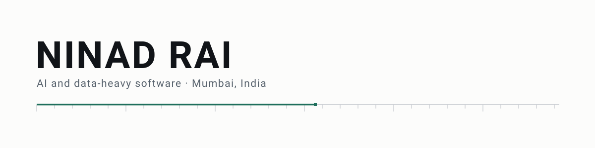
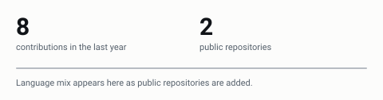

<!-- BANNER -->
<picture>
  <source media="(prefers-color-scheme: dark)" srcset="./assets/banner-dark.svg">
  
</picture>

<!-- PROFILE-IMAGE -->
<!--
  Headshot slot. Ninad will add one image file here later (for example assets/headshot.jpg).
  Design around a square crop: source about 512x512, rendered at about 160px, sitting top-right of the intro.
  If no image file is present yet, the layout should collapse cleanly with no gap and no placeholder graphic.
-->

```yaml
name: Ninad Rai
location: Mumbai, India
focus: AI and data-heavy software
currently: building Vertex Terminal, a global investment research platform
learning: the maths and systems behind modern AI
```

<!-- Headshot: once assets/headshot.jpg (square, about 512x512) exists, uncomment the line below.
     It floats to the top-right and the intro text wraps to its left; nothing else changes.

-->

I build software that collects, structures, and analyses large amounts of data, mostly in finance and health. Recent work is full-stack with a Python data layer behind it, run on free-tier infrastructure so the whole system stays cheap to host and straightforward to reproduce. Right now the day-to-day is Vertex Terminal and a bat vocalization pipeline.

## Selected work

<!-- PROJECTS:START -->
### Vertex Terminal

Bloomberg-style research terminal for global markets, covering watchlists, company profiles, SEC EDGAR Form 4 insider trades, and AI summaries of filings and news. Built and deployed end to end on free-tier infrastructure.

<p>
  
  
  
  
  
  
  
</p>

Stack: Next.js, TypeScript, Python, FastAPI, Supabase, GitHub Actions, Vercel, Render

`Private · opening soon`

### KayaRift 3.0

AI health platform built around organ simulation, gamification, and multimodal input.

<p>
  
  
  
</p>

Stack: React, Next.js, TypeScript

`Private · opening soon`
<!-- PROJECTS:END -->

## Activity

<!-- STATS: ./assets/stats-*.svg, regenerated by .github/workflows/render-stats.yml -->
<picture>
  <source media="(prefers-color-scheme: dark)" srcset="./assets/stats-dark.svg">
  
</picture>

Generated from my own GitHub activity and refreshed on a schedule.

<!-- SNAKE: contribution snake, pushed to the output branch by .github/workflows/snake.yml on its first run -->
<!-- SNAKE:START -->
<!-- SNAKE:END -->

## Research

**Bioacoustics.** A vocalization-analysis pipeline for the Egyptian fruit bat (*Rousettus aegyptiacus*). Manuscript in progress.

**HYMCC.** SU(3) gauge-theoretic diagnostics for multi-task gradient conflict. The result is a verified negative one: the method does not deliver the expected gain, and the write-up reports that directly.

## Elsewhere

Director of Digital Growth at Project GRID, a student-run nonprofit that runs the Aurora and N3C hackathon tracks in association with IIT Delhi.

Three-time Lodha Genius Programme Scholar, Ashoka University.

## Currently

Getting Vertex Terminal ready to open, and writing up the bat bioacoustics study.

## Links

[LinkedIn](https://www.linkedin.com/in/ninad-rai-napolianadmin) · [GitHub](https://github.com/NapolianAdmin)
